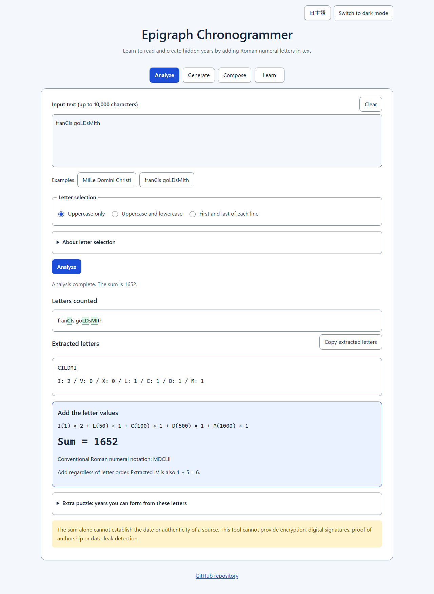
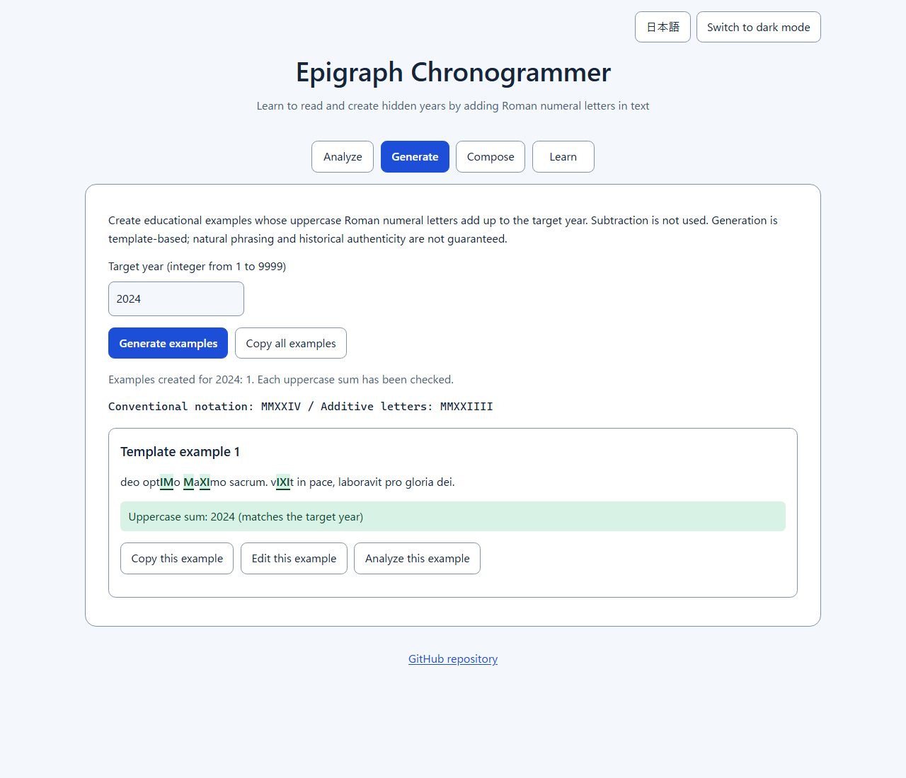
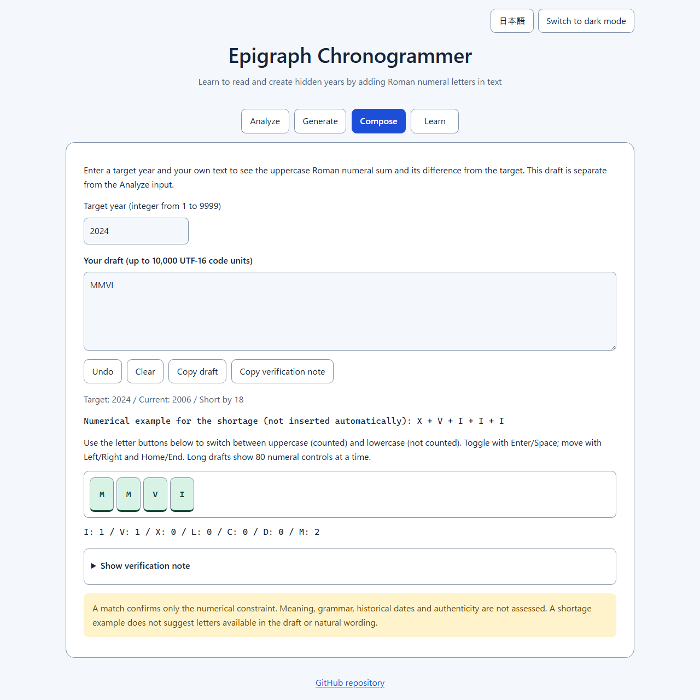

English · [日本語](README.md)

# Epigraph Chronogrammer - Chronogram Analyzer & Generator


[](https://ipusiron.github.io/epigraph-chronogrammer/)

**Day086 - 100 Security Tools with Generative AI**

Epigraph Chronogrammer is an educational tool for chronograms: texts whose Roman numeral letters add up to a year.
It highlights the letters counted, explains the calculation and generates educational examples from a year, entirely in your browser.
The sum alone cannot establish the date of a historical source or prove authorship or authenticity.

## 🌐 Demo

[Open Epigraph Chronogrammer](https://ipusiron.github.io/epigraph-chronogrammer/)

No installation is needed.
You can also open a downloaded copy of `index.html` directly.
Use the controls at the top right to switch between Japanese and English, or light and dark mode.

## 📸 Screenshots



*The selected letters in franCIs goLDsMIth add up to 1652.*



*Conventional Roman numeral notation is displayed separately from the letters used for addition.*

[Dark mode at a mobile width](assets/en/mobile-dark.png)



*See the shortage of 18 and use letter buttons to adjust which letters count.*

## 📜 How chronograms work

The letter values are I=1, V=5, X=10, L=50, C=100, D=500 and M=1000.
Extract the intended letters and add their values; no rearrangement is needed.
In conventional Roman numerals, IV is 4, but this tool's addition gives I + V = 6.

Historical sources may distinguish the intended letters by typeface rather than capitalization alone.
If that typography is lost, plain text may not be enough to determine which letters to count.
[Folger Shakespeare Library's discussion of its collections](https://www.folger.edu/blogs/collation/time-writing/) shows examples that distinguish roman and italic type.

## ⚙️ Features and usage

### Analyze

Enter text or select an example, choose a letter selection mode and press Analyze.
Changing the input or settings clears the results and disables copying.
Press Analyze again to calculate from the current input.
Clear removes the input and analysis results, but not selection settings, content in Generate or Compose, or the operating system's clipboard.

| Selection mode | Letters counted |
|---|---|
| Uppercase only | ASCII I, V, X, L, C, D and M |
| Uppercase and lowercase | The letters above plus i, v, x, l, c, d and m |
| First and last of each line | Matching letters at either end after trimming whitespace. This experimental mode counts a one-character line only once |

Input is limited to 10,000 UTF-16 code units.
Some displayed characters, such as emoji, occupy multiple units.
CRLF, LF and CR are recognized as line breaks.
U/V, J/I, full-width characters and Unicode Roman numeral characters are not converted automatically.
Check the original source's notation and the rule you intend to use before entering text.

The sum and per-letter breakdown are displayed independently of the search range.
If the sum is within 1–9999, conventional Roman numeral notation is also shown.
For 4000 and above, this tool uses an extended notation that repeats M.

### Extra puzzle

Open “Years you can form from these letters” to construct conventional Roman numeral years from your available letters.
This is a separate puzzle, not an application of the sum method and not a list of possible dates for a historical source.

- Use some letters: ignore leftover letters
- Use every letter: show only years that match the letter types and counts exactly
- Search range: integers from 1 to 9999; default 1500–2100
- Century presets: centuries 16–21; the 16th century is 1501–1600 and the 19th is 1801–1900
- Display: up to 12 results in ascending year order, with total matches and displayed matches reported separately

Decimals, exponential notation and a minimum greater than the maximum produce an error.
Inputs are not truncated, and range limits are not swapped automatically.

### Generate

Enter an integer year from 1 to 9999 and press Generate examples.
The tool capitalizes additive letters in existing templates, then reanalyzes every example to verify that its sum matches the year.
Conventional notation and additive letters are displayed separately.

Depending on the year, up to 3 template examples are shown.
If no template has enough of each required letter, one “Explanatory letter sequence” lists the additive letters directly.
For example, 9999 uses this fallback.
Natural phrasing, the quality of the Latin and historical authenticity are not guaranteed.

You can copy examples individually or together.
Changing the year clears the generated results and disables copying.
If the browser refuses clipboard access, select and copy the displayed text manually.
Choose Uppercase only when reanalyzing a generated example.

“Edit this example” sends the example and target year to Compose.
“Analyze this example” sends it to Analyze and selects Uppercase only.
Press Analyze to run the calculation. The puzzle search range is not changed.
Replacing existing text requires confirmation; canceling keeps the input intact.
Sending an example to Compose can be undone with Undo.

### Compose

Enter a target year and your own draft to see the uppercase Roman numeral sum and its difference from the target immediately.
The target must be an integer from 1 to 9999, and the draft is limited to 10,000 UTF-16 code units.
The draft is independent of Analyze; editing it does not change the analysis input.

| Draft | Target year | Sum | Difference (target minus sum) |
|---|---|---|---|
| `MMVI` | 2024 | 2006 | 18 |
| `MML` | 2024 | 2050 | -26 |
| `MMXXIIII` | 2024 | 2024 | 0 |

For a shortage of 18, the tool displays the numerical example `X + V + I + I + I`.
It does not insert letters automatically or determine whether the draft contains them or whether they produce natural wording.
An excess is shown as the amount over the target; equality is reported as “Matches the target number”.

Press a numeral in the preview to switch between uppercase (counted) and lowercase (not counted).
Letter order is preserved, and non-ASCII characters are not converted.
Tab to the letter buttons, use Left/Right and Home/End to move within the displayed part, and toggle with Enter/Space.
Long previews show 80 numeral controls at a time, but the sum and copying use the entire draft.
During Japanese IME composition, recalculation and copying pause until the text is committed.

Undo reverses up to 50 operations involving text, the target year, letter toggles or loading a generated example.
Ordinary typing records each input event; IME preedit changes are grouped when committed.
Clear erases the draft and undo history while keeping the target year.
Clear cannot be undone. It does not clear other tabs or the operating system's clipboard.
Input and history are lost when the page is closed or reloaded; they are not saved automatically.

Copy draft copies only the text. Copy verification note copies the target year, selection mode, extracted letters, sum, difference, draft and limitations.
The note can also be displayed on screen and selected manually if clipboard access is denied.
An empty draft, invalid year or excessive text length clears the note and disables its copy button.
A matching sum confirms only the numerical constraint, not meaning, grammar, dating or authenticity.

### Learning and display preferences

The Learn tab covers the principle, its difference from conventional Roman numerals, historical sources with references, hidden writing, writing and checking exercises, and privacy.
Explanations can be expanded with a click or Enter/Space.
Tabs also support the Left/Right arrow keys, Home and End.

The initial language is selected from `?lang=ja|en`, then a saved preference, then the browser language.
Browser languages other than Japanese select English.
The theme uses a saved preference when available and otherwise follows the operating system.
Analysis and generation still work when storage is blocked.

## 📝 Examples you can verify

| Input | Mode | Extracted letters | Sum |
|---|---|---|---|
| `MilLe Domini Christi` | `all` | `MILLDMIICII` | 2705 |
| `MilLe Domini Christi` | `uppercase` | `MLDC` | 1650 |
| `MilLe Domini Christi` | `positional` | `MI` | 1001 |
| `franCIs goLDsMIth` | `uppercase` | `CILDMI` | 1652 |
| `IV` | `uppercase` | `IV` | 6 |
| `CILDMI` | `uppercase` | `CILDMI` | 1652 |
| `IMDLIC` | `uppercase` | `IMDLIC` | 1652 |

`MilLe Domini Christi` is a teaching example for comparing selection settings, not a historical source with verified provenance.
`franCIs goLDsMIth` is an input example based on a person's name, not a book title.
To determine what year a result actually refers to, check the original source's bibliography and context separately.

Searching `MLDC` within 1500–2100 gives 4 results with Use some letters: 1500, 1550, 1600 and 1650. Use every letter gives 1 result: 1650.
The sum of 1650 and the number of puzzle matches are different pieces of information.

| Target year | Conventional notation | Additive letters |
|---|---|---|
| 4 | `IV` | `IIII` |
| 9 | `IX` | `VIIII` |
| 2024 | `MMXXIV` | `MMXXIIII` |
| 9999 | `MMMMMMMMMCMXCIX` | `MMMMMMMMMDCCCCLXXXXVIIII` |

## 🎯 Use cases

Ways of using this tool in particular

- Compare transcription choices: `MilLe Domini Christi` sums to 1650 with uppercase only and 2705 with both cases. Demonstrate in class how losing typography or capitalization can change the reading
- Check an anniversary card: generate 2024 and compare the additive `MMXXIIII` with the conventional `MMXXIV`. Reanalyze the example with Uppercase only to check the card's numerical constraint
- Explore the limits of a sum: `CILDMI` and `IMDLIC` both give 1652. Use an unchanged sum after rearrangement to explain why it cannot detect tampering or prove authorship
- Adjust a puzzle's difficulty: use the gap of 18 between a target of 2024 and the sum of 2006 for `MMVI` to set a letter-completion challenge. The numerical example `XVIII` adds up to 18, but check the answer's natural wording separately

General uses

- Education: exercises in cryptographic history or computing that compare letter selection, aggregation and numerical notation
- Work: check calculations after transcribing public materials you are permitted to use; retain the source image and bibliography separately
- Everyday life and hobbies: anniversary cards, puzzles and typography projects
- Research: assist calculations for sources whose relevant letters have been checked manually; never date a source from this output alone
- Combining tools: paste text from external OCR or writing tools to check its sum, after checking the original emphasis and any recognition errors

There is no need to use confidential documents or personal information.
Public materials or examples you write yourself are enough for learning.

## 🔒 Security and limitations

Input and results are processed in the browser, without being sent to a server or saved in browser storage.
Only language and theme preferences are saved.
The tool does not clear content copied to the operating system's clipboard.
Fetching the public page and opening external links cause ordinary network requests.

- Cannot provide encryption, digital signatures, proof of authorship or data-leak detection
- Cannot automatically determine a source's date, authenticity or intended letter selection rule
- No OCR, LLM, batch input or image analysis
- A plausible year from the sum or puzzle does not mean the text was intended to convey that year
- Generated examples are educational and do not guarantee historical truth or natural phrasing

The CSP permits only local scripts and styles, and input is displayed as text nodes rather than interpreted as HTML.
The `frame-ancestors` directive for preventing embedding cannot be set through a meta element.
`.htaccess` is optional Apache configuration and is not processed by GitHub Pages.

## 🔗 References

- [Folger Shakespeare Library: Time writing](https://www.folger.edu/blogs/collation/time-writing/): examples from its books and an explanation of addition
- [RISM: A Numerical Riddle, or a Chronogram in a Musical Manuscript](https://rism.info/fr/library_collections/2023/06/22/a-numerical-riddle-chronogram-in-a-musical-manuscript.html): an example from the University of Warsaw Library's music collection
- [Chronogram calculator](https://kgjenkins.github.io/chronogram/): a calculator focused on adding letter values

Epigraph means an inscription; Chronogrammer is a coined name for something that works with chronograms.

## 📁 Directory structure

```text
epigraph-chronogrammer/
├── .github/workflows/test.yml  # Automated Node.js tests
├── index.html                 # Analyze, Generate, Compose and Learn views
├── core.js                    # Extraction, addition, search and generation
├── state.js                   # Input and result state
├── composer-core.js           # Draft differences and letter toggling
├── composer-state.js          # Independent draft state and undo history
├── script.js                  # DOM rendering and events
├── preferences.js             # Initial theme and language
├── messages.js                # Japanese and English UI strings
├── style.css                  # Responsive layout and both themes
├── package.json               # Dependency-free test commands
├── test/                      # Logic, state, documentation and security tests
├── assets/                    # Japanese screenshots
│   └── en/                    # English screenshots
├── README.md                  # Japanese documentation
├── README.en.md               # English documentation
├── CLAUDE.md                  # Development guidance
├── .htaccess                  # Optional Apache configuration
├── .nojekyll                  # Disable Jekyll processing on Pages
├── .gitignore                 # Exclude local-only files
└── LICENSE                    # MIT license
```

## 💻 Environment and tests

No build step or external library is required.
For local HTTP viewing, run `python -m http.server 8000`.
Direct file viewing has also been tested in Chromium.
Safari and physical devices have not been tested.

With Node.js 22 or later, run the tests without installing packages.

```sh
npm test
```

Tests cover known calculations, reanalysis of generated output for years 1–9999, result invalidation, Japanese/English message keys, README headings and values, CSP and color contrast.
CI runs the same tests on push and pull_request.
Browser interactions and screenshots are checked separately.
If Python Playwright and Chromium are available, you can also run the interaction tests below.

```sh
python test/browser.py --layout --bilingual
```

They check both languages and themes at widths of 320, 390 and 1280px through a temporary local HTTP server and direct file viewing.
The script does not automatically install missing packages or browsers.

## 📄 License

MIT License.
See [LICENSE](LICENSE) for details.
No external runtime libraries are used.

## 🛠️ About this tool

This tool was developed as part of the “100 Security Tools with Generative AI” project.
The project uses AI assistance to create and publish security-related tools over 100 days.

[Project details and other tools](https://akademeia.info/?page_id=42163)
