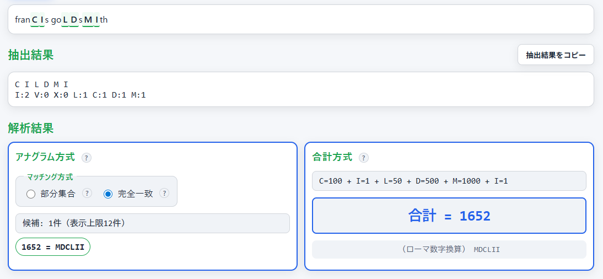

<!--
---
title: Epigraph Chronogrammer
category: classical-cryptography
difficulty: 1
description: Educational tool to explore chronograms: extract Roman numerals, compute hidden years, and generate texts with embedded dates.
tags: [chronogram, roman-numerals, classical-crypto, education, visualization, javascript]
demo: https://ipusiron.github.io/epigraph-chronogrammer/
---
-->

# Epigraph Chronogrammer - クロノグラム解析・生成ツール


[](https://ipusiron.github.io/epigraph-chronogrammer/)

**Day086 - 生成AIで作るセキュリティツール100**

**Epigraph Chronogrammer** は、碑文や文献に埋め込まれた年号暗号「クロノグラム」を学習・体験できる  
**クロノグラム解析・生成ツール** です。

- クロノグラム文章中のローマ数字（I, V, X, L, C, D, M）を抽出して合計し、隠された年号を算出します。  
- アナグラム機能を搭載し、抽出された文字を並べ替えて歴史的に意味のある年号（1500–2100）を導出します。  
- 年号から逆にクロノグラム風の文章を生成する機能も備えています。  
- 座学タブで歴史的背景や応用を学べます。  

---

## 🌐 デモページ

👉 **[https://ipusiron.github.io/epigraph-chronogrammer/](https://ipusiron.github.io/epigraph-chronogrammer/)**

ブラウザーで直接お試しいただけます。

---

## 📸 スクリーンショット

>
>*"franCIs goLDsMIth"を解析*

---

## 💡 ツール名の由来

- **Epigraph（エピグラフ）**
  - "epigraph"は「碑文」「銘文」の意味の英単語。
  - クロノグラムは歴史的に、石碑や建築物の銘文に刻まれることが多かったため、この語を採用した。

- **Chronogrammer（クロノグラマー）**  
  - 「クロノグラムを扱う人／生成するもの」を意味する造語。  
  - "programmer"の語感も重ね、デジタル時代のクロノグラム職人を示唆している。  

👉 両者を組み合わせることで、 **「碑文に刻まれたクロノグラムを発見・生成・解読する職人工具」** という意味を込めています。

---

## 📜 クロノグラムとは

**クロノグラム（chronogram）** は、文章中に含まれるローマ数字（I, V, X, L, C, D, M）を取り出して数値に換算し、その合計が特定の年号（西暦）になるように設計されたテキスト表現です。

たとえば「franCIs goLDsMIth」から大文字のローマ数字を抽出します。
すると「C=100, I=1, L=50, D=500, M=1000, I=1」が得られるので、アナグラムで「MDCLII」に並び替えると合計 **1652** が得られ、西暦1652年を表します（詳細は後述）。

---

### ローマ数字の抽出方法の多様性

クロノグラムは「文章中のどのローマ数字をカウントするか」によって結果が変わります。  
歴史的にも、碑文や書籍によって抽出規則は統一されておらず、いくつかのバリエーションが存在しました。

- **全文字抽出方式**  
  文章中に現れるローマ数字（I, V, X, L, C, D, M）をすべて拾い上げる方法。  
  → もっともシンプルで、現代の自動解析ツールに適している。

- **大文字のみ抽出方式**  
  大文字で書かれたローマ数字のみを対象とする方法。  
  → 碑文では大文字と小文字を区別して刻むことで「強調」された文字だけを数える事例がある。

- **位置依存抽出方式**  
  文頭・文末・行頭など「特定の位置」にあるローマ数字だけを拾う方式。  
  → アクロスティックや隠文式暗号との境界に近く、デザイン性の高いクロノグラムに用いられた。

---

### 歴史的利用

ルネサンス〜バロック期（16〜18世紀）に特に流行し、碑文や建築物の銘文、書籍の刊行年表示として利用されました。  

クロノグラムは単なる修辞的遊びではなく、時に検閲回避や象徴的意味付けの役割を担いました。

---

### 暗号・ステガノグラフィーとの関係

クロノグラムは暗号としての強度はありませんが、「一見普通の文章に別の情報（年号）を隠す」という点で、古典的なステガノグラフィーの一形態と位置づけられます。

---

## 🔢 ローマ数字による年代表記法

- **基本記号と値**
  - I = 1  
  - V = 5  
  - X = 10  
  - L = 50  
  - C = 100  
  - D = 500  
  - M = 1000  

- **加算方式**  
  文字を左から右へ並べ、それぞれの値を合計して表記する。  
  例：  
  - VIII = 5 + 1 + 1 + 1 = 8  
  - LX = 50 + 10 = 60  

- **減算方式（サブトラクティブ・ノーテーション）**  
  大きな数字の左に小さな数字が置かれると「引く」意味になる。  
  例：  
  - IV = 5 − 1 = 4  
  - IX = 10 − 1 = 9  
  - XL = 50 − 10 = 40  
  - CM = 1000 − 100 = 900  

- **年号表記の慣例**  
  - 西暦はローマ数字で表記されることが多く、碑文・公文書・教会建築などに残っている。  
  - 例：  
    - 1600 = MDC  
    - 1666 = MDCLXVI  
    - 2025 = MMXXV  

- **クロノグラムにおける利用**  
  - 年号そのものを直接書く代わりに、文章中のローマ数字の合計で年を示す。  
  - 読者は「どの文字を数えるのか」を知っている必要があり、これが隠されたメッセージ性を持つ。  
  - この方法により、碑文や献辞に象徴的な意味を付与することが可能だった。

---

## 📝 利用例

### 例1

- 入力: `MilLe Domini Christi`
- 大文字を抽出: M, L,  
- ローマ数字を抽出: M, I, L, L, D, M, I, I, C, I, I
  - 数値化: 1000(M)×2 + 1(I)×5 + 50(L)×2 + 500(D) + 100(C) = 2707
- 大文字のローマ数字を抽出: M, L, D, C
  - アナグラム: `MDCL`
  - 数値化: 1650
- 年号の範囲内を考慮すると、1650に絞られる。

### 例2

- 入力: `franCIs goLDsMIth`（本のタイトル）
- ローマ数字を抽出: C, I, L, D, M, I, T
- 大文字のローマ数字を抽出: C, I, L, D, M, I
- アナグラム: MDCLII
- 数値化: 1652
- 結果: この本は1652年に製作されたことが浮かび上がる。

---

## ⚙️ 機能とタブ構成

### 1. 解析タブ

**抽出方式の選択**
- **全文字抽出**: すべてのローマ数字（I,V,X,L,C,D,M）を抽出。シンプルで自動解析に適している。
- **大文字のみ**: 大文字で書かれたローマ数字のみ抽出。碑文で強調された文字のみを数える。
- **位置依存**: 行頭・行末のローマ数字のみ抽出。アクロスティック的な意匠が施されたクロノグラムに対応。

**解析方法（両方同時に表示）**
- **アナグラム方式（候補探索）**: 抽出した文字の手持ちだけで特定年のローマ数字表記を構成できるかを探索。指定範囲内（デフォルト1500–2100）の候補年を最大12件表示。
- **合計方式（歴史的クロノグラム）**: 抽出文字を数値化し合計（I=1, V=5, X=10, L=50, C=100, D=500, M=1000）。

**その他の機能**
- 入力テキスト中のローマ数字をハイライト表示
- 抽出結果のコピー機能
- 例文プリセット（`MilLe Domini Christi`, `franCIs goLDsMIth`）
- 西暦範囲のカスタマイズ（1〜9999年）とプリセット（16〜21世紀）
- ダークモード/ライトモード切り替え

---

### 2. 生成タブ

- 西暦（1〜9999年）を入力すると、その年号のローマ数字表記を表示
- 指定年号のローマ数字を含む自然な英文を自動生成（3〜5パターン）
- 生成文中のローマ数字部分を大文字＋ハイライト表示
- 各文例に個別コピーボタン、全文例一括コピー機能

**生成アルゴリズム**
- テンプレート文から必要なローマ数字文字数を検証
- 条件を満たすテンプレートのみを自動選択
- 小文字の文中で、ローマ数字として使用する文字のみを大文字化

---

### 3. 座学タブ

アコーディオン形式で以下の内容を学習できます：

1. **クロノグラムとは**: 定義、歴史的背景（16〜18世紀の利用）
2. **ローマ数字による年代表記法**: 基本記号、加算方式、減算方式、年号表記の慣例
3. **歴史的利用と文化**: 碑文・建築物、書籍刊行年、文学・詩的表現
4. **関連する隠し文字技法**: アクロスティック、隠文式暗号、ステガノグラフィー
5. **現代への応用可能性**: 自然言語処理、デジタル署名、セキュリティ教育、デジタル人文学
6. **本ツールについて**: デフォルト範囲の理由、ツール名の由来、セキュリティ的示唆  

---

## 👥 対象ユーザー

- 古典暗号・暗号史に興味を持つ学生や研究者
- ステガノグラフィーや隠しメッセージの歴史を学びたい人
- 暗号解読の教育・デモ用ツールを探している教育者

---

## 📖 具体的な活用シナリオ

### シナリオ1: 大学の暗号史講義での教材活用

**状況:**
大学の情報セキュリティ科目で「古典暗号からステガノグラフィーまで」の歴史を教える教員が、学生に「情報隠蔽の発想の起源」を体験的に学ばせたい。

**活用方法:**
1. **座学タブで歴史的背景を学習**
   講義の導入として、クロノグラムの歴史的背景・利用事例・ステガノグラフィーとの関連性を座学タブで学習させる。

2. **解析タブで実際の碑文を解読**
   教員が準備した歴史的クロノグラム例文（例: `franCIs goLDsMIth`）を入力し、大文字のみ抽出方式で解析。
   学生は「1652年」という隠された年号を発見し、「一見普通の文章に別の情報を隠す」という古典的ステガノグラフィーの本質を体験する。

3. **生成タブで現代的応用を考察**
   学生自身が記念年（例: 大学創立年）を入力し、クロノグラム文を自動生成。
   「どのような文章なら自然に年号を埋め込めるか」を議論し、AIによる制約付きテキスト生成の可能性を考察する。

**効果:**
- 古典暗号の「情報を隠す発想」が現代のデジタル透かしやAI生成文の検出に繋がることを実感できる。
- 理論だけでなく「実際に解読・生成する」体験により、学習定着率が向上する。

---

### シナリオ2: デジタル人文学研究での史料年代推定

**状況:**
デジタル人文学（Digital Humanities）の研究者が、17世紀ヨーロッパの碑文や書籍のOCRデータから「刊行年や建立年が不明な文献」の年代を推定したい。

**活用方法:**
1. **OCRテキストの一括解析**
   碑文や書籍のタイトルページをOCRで読み取り、本ツールの解析タブに入力。
   大文字のみ抽出方式とアナグラム方式を組み合わせ、1500〜1700年の範囲で候補年を探索。

2. **複数の抽出方式で検証**
   全文字抽出・大文字のみ・位置依存の3方式を試し、複数の候補年が得られた場合は歴史的文脈（戦争・王朝・イベント）と照合。
   例: 候補が「1618」「1648」の場合、三十年戦争（1618-1648）との関連性を検討。

3. **結果の記録とデータベース化**
   解析結果をコピー機能で保存し、年代推定データベースに蓄積。
   複数の文献で同じ年号パターンが見つかれば、「同時期に同じ工房で製作された可能性」などの仮説を立てられる。

**効果:**
- 従来は「専門家の勘と経験」に頼っていた年代推定作業を、半自動化・可視化できる。
- クロノグラム文化圏（ドイツ・オランダ・イタリア）の文献に対して、網羅的な年代探索が可能になる。

---

### シナリオ3: セキュリティ研修での「隠蔽情報の検出」演習

**状況:**
企業のセキュリティ研修で、「情報漏洩の手口を知る」ことで防御力を高めたい。特に「一見無害なテキストに情報を隠す」ステガノグラフィーの脅威を理解させたい。

**活用方法:**
1. **古典的ステガノグラフィーの理解**
   座学タブで「クロノグラムは古典的ステガノグラフィーの一種」であることを学習。
   「暗号は情報を読めなくするが、ステガノグラフィーは情報の存在自体を隠す」という違いを理解する。

2. **検出演習: 疑わしいテキストの解析**
   研修講師が用意した「情報漏洩を模した文章」（例: 社内メールやレポートのタイトル）を解析タブに入力。
   受講者は「どのようなパターンで情報が隠されているか」を探索し、ローマ数字の配置に規則性がないかを確認する。

3. **対策の議論: 現代への応用**
   クロノグラムの原理を踏まえ、「現代のテキストベース情報漏洩」の可能性を議論。
   - 例1: LLMが生成した文章に「生成日時」をクロノグラム的に埋め込む（ウォーターマーク）
   - 例2: 社内文書に「送信者ID」をローマ数字的パターンで隠す（漏洩時の追跡）
   - 例3: ソーシャルエンジニアリングで「無害な文章に見せかけて機密情報を伝達」する手口

4. **防御策の検討**
   テキスト解析ツールで「不自然なローマ数字の集中」を検出するルールを考案。
   DLP（Data Loss Prevention）システムへの応用可能性を議論。

**効果:**
- 古典的手法を学ぶことで、「情報隠蔽の本質的な発想」を理解できる。
- 「過去の技術が形を変えて現代に応用される」という視点を持ち、新しい脅威への対応力が向上する。
- セキュリティは「技術だけでなく人間の創造性との戦い」であることを実感できる。

---

## 🔗 クロノグラムと他の隠し文字技法の関連性

- **クロノグラム (Chronogram)**  
  テキスト中のローマ数字（I, V, X, L, C, D, M）を抽出し、合計して年号を示す技法。  
  → 「数値」を隠すことが目的で、16〜18世紀の碑文や書籍刊行年に多く利用された。

- **アクロスティック (Acrostic)**  
  詩や文章の各行の先頭文字を縦に読むと、特定の単語や意味が浮かび上がる修辞的表現。  
  → クロノグラム同様「通常の読み方とは異なる規則」で別の意味を隠す。

- **隠文式暗号 (Concealed Text Cipher)**  
  文章の特定の位置（行頭・行末・一定間隔など）を抜き出して隠された情報を得る暗号方式。  
  → アクロスティックを暗号的に利用したものとみなせる。クロノグラムも「特定文字のみを抜き出す」という点でこの系譜に連なる。

- **ステガノグラフィー (Steganography)**  
  「情報が隠されていること自体を秘匿する」技術の総称。  
  → アクロスティックやクロノグラムは、古典的ステガノグラフィーの具体例と位置づけられる。  
  → メッセージを隠すのではなく「普通の文に別の意味を仕込む」という点で、現代の電子透かしやメタデータ隠しと通じる。

---

### 関連性のまとめ

- **共通点**  
  - 表面上は自然な文章だが、特定のルールで読むと隠された情報が現れる。  
  - 情報の「抽出規則」を知っている者だけがメッセージを理解できる。  
  - 文学的遊戯と暗号的秘匿の境界領域に存在する。

- **相違点**  
  - **クロノグラム**：隠す対象は「年号（数値）」。  
  - **アクロスティック**：隠す対象は「単語・名前・意味」。  
  - **隠文式暗号**：暗号学的応用を前提に規則性を強調。  
  - **ステガノグラフィー**：より広義で「隠された通信」を包括する概念。  

---

## 🏛️ クロノグラムの歴史・文化・教育における応用

- **碑文・建築物**  
  クロノグラムは16〜18世紀のヨーロッパで盛んに利用され、石碑や建築物の銘文に年号を隠す形で用いられた。  
  例：ドイツやイタリアの教会に刻まれた碑文では、ローマ数字の合計が建立年を表す。

- **書籍刊行年の暗示**  
  初版・刊行年を直接明示せず、クロノグラムで「隠す」手法が近世ヨーロッパの印刷文化で利用された。  
  → 検閲回避や遊戯的な装飾として機能。

- **文学・詩的表現**  
  クロノグラムはアクロスティックやテレストリックと並び、修辞的な遊びとして使われた。  
  → 詩や謎掛けで、作者名や記念年を暗示する。

- **教育・記憶術**  
  数字と文字を結びつけることで、歴史教育や暗記補助に利用。  
  特にラテン語教育において「言葉遊びを通じて年号を覚える」方法として使われた記録がある。

- **芸術・デザイン**  
  タイポグラフィや現代アートでは「隠された数値」を可視化するコンセプトとして参照される。  
  → 数字を文字に埋め込み、表層と深層を二重化する仕組みが美学的に評価されている。

---

## 💻 コンピューター・セキュリティ・AIにおけるクロノグラムの応用可能性

- **ステガノグラフィー**  
  - テキスト中に年号やIDを「ローマ数字の合計」として隠す。  
  - 例：ログやメタデータに目立たない形で情報を埋め込む。  
  - 暗号強度は弱いが、「人間には気づきにくい隠蔽」という教育的デモに適用可能。

- **自然言語処理 (NLP) × クロノグラム生成**  
  - AIを用いて、指定年号を満たすクロノグラム文を自動生成可能。  
  - GPTやLLMはローマ数字の制約を満たす文章生成に強みを発揮。  
  - 将来的には「意味のある文章で、かつ特定の数値条件を満たす」文を生成する課題（制約付き生成）に応用できる。

- **デジタル署名やウォーターマーク**  
  - 文書や記事の発行年を直接書かず、クロノグラム的に隠すことで「作者性」や「生成年」の痕跡を残す。  
  - 特に生成AI時代における「文章への不可視ウォーターマーク」の歴史的比喩・教育モデルとして応用可能。

- **セキュリティ教育ツール**  
  - クロノグラムは「平文に隠されたパターンを見抜く」練習問題として利用できる。  
  - 暗号史だけでなく、現代のソーシャルエンジニアリングやステガノグラフィー理解に繋がる教材になる。

- **AIによる検出・解読**  
  - OCRやNLPを利用して「クロノグラムを含む文献から年代を自動抽出」する研究が可能。  
  - デジタル人文学（Digital Humanities）における史料解析手法としての拡張が考えられる。

- **発展的アイデア（独自示唆）**  
  - LLMに「与えられた年号をクロノグラムで暗示する詩」を書かせ、その創造性を評価する。  
  - 年号ではなく「暗号鍵」や「識別子」をクロノグラム的に文章に埋め込み、AIがそれを検出できるかを評価する。  
  - ディープラーニングによる「クロノグラム文のスタイル学習」により、歴史的テキストの偽造検出や生成にも応用できる。

---

###  まとめ

クロノグラムは、暗号としての強度は低いものの、**「意味あるテキストに数値条件を潜ませる」** という発想は、AI時代に再評価される可能性を秘めているかもしれません。

---

## 📁 ディレクトリー構成

```
epigraph-chronogrammer/
├── index.html          # メインHTML（3タブ構成）
├── script.js           # クロノグラム解析・生成ロジック
├── style.css           # スタイリング（ダークモード/ライトモード対応）
├── README.md           # 本ドキュメント
├── LICENSE             # MITライセンス
├── CLAUDE.md           # 開発ドキュメント（Claude Code用）
├── .nojekyll           # GitHub Pages設定
├── .htaccess           # セキュリティヘッダー（Apache用）
├── .gitignore          # Git除外設定
└── assets/
    └── screenshot.png  # スクリーンショット
```

---

## 📄 ライセンス

MIT License – 詳細は [LICENSE](LICENSE) を参照してください。

---

## 🛠 このツールについて

本ツールは、「生成AIで作るセキュリティツール100」プロジェクトの一環として開発されました。
このプロジェクトでは、AIの支援を活用しながら、セキュリティに関連するさまざまなツールを100日間にわたり制作・公開していく取り組みを行っています。

プロジェクトの詳細や他のツールについては、以下のページをご覧ください。

🔗 [https://akademeia.info/?page_id=42163](https://akademeia.info/?page_id=42163)
