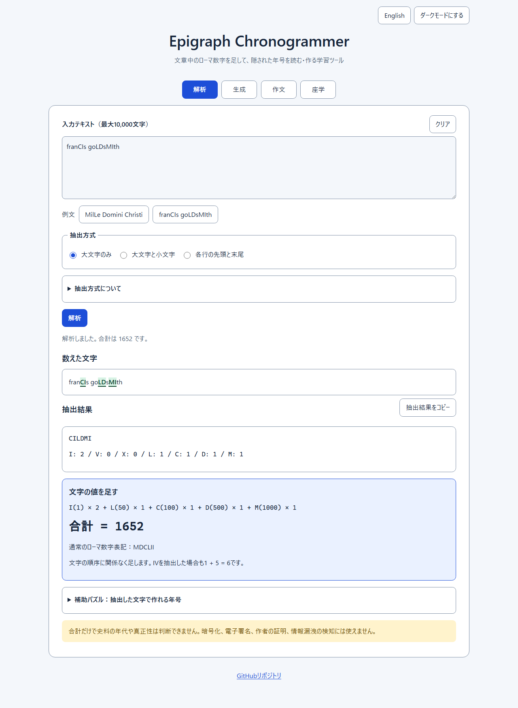
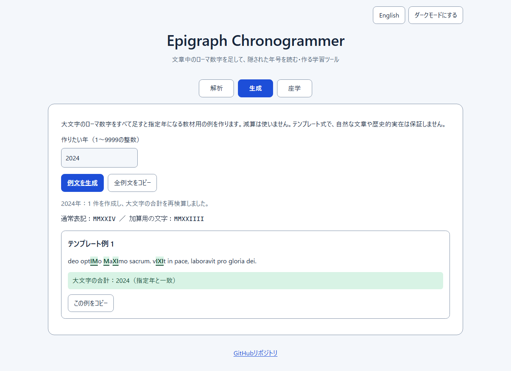
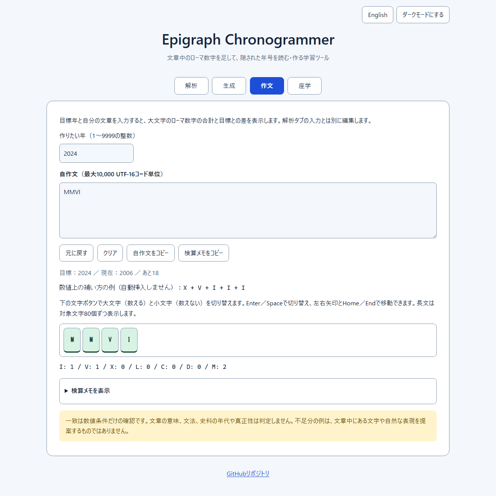

<!--
---
id: day086
slug: epigraph-chronogrammer

title: "Epigraph Chronogrammer"

subtitle_ja: "クロノグラム解析・生成ツール"
subtitle_en: "Chronogram Analyzer & Generator"

description_ja: "碑文や文献に埋め込まれたクロノグラム（ローマ数字による年代表記法）を解析・生成できる教育ツール。ローマ数字の抽出、隠された年号の算出、クロノグラム文の自動生成機能を搭載。"
description_en: "Educational tool for analyzing and generating chronograms—texts where Roman numerals encode hidden years. Extract Roman numerals, compute embedded dates, and generate chronogram sentences."

category_ja:
  - 古典暗号
  - ステガノグラフィー
category_en:
  - Classical Cryptography
  - Steganography

difficulty: 1

tags:
  - chronogram
  - roman-numerals
  - steganography
  - classical-crypto
  - education
  - visualization
  - javascript

repo_url: "https://github.com/ipusiron/epigraph-chronogrammer"
demo_url: "https://ipusiron.github.io/epigraph-chronogrammer/"

hub: true
---
-->

[English](README.en.md) · 日本語

# Epigraph Chronogrammer - クロノグラム解析・生成ツール


[](https://ipusiron.github.io/epigraph-chronogrammer/)

**Day086 - 生成AIで作るセキュリティツール100**

Epigraph Chronogrammerは、文章中のローマ数字を足して年号を表す「クロノグラム」の学習ツールです。
数えた文字の強調表示、計算内訳、年からの教材用例文の生成を、ブラウザー内で行います。
合計だけで史料の年代を確定したり、作者や真正性を証明したりすることはできません。

## 🌐 デモページ

[Epigraph Chronogrammerを開く](https://ipusiron.github.io/epigraph-chronogrammer/)

インストールは不要です。
ダウンロードした`index.html`を直接開いても使えます。
画面右上で日本語／英語とライト／ダークを切り替えられます。

## 📸 スクリーンショット



*franCIs goLDsMIthの指定文字を足すと1652になります。*



*通常のローマ数字表記と、加算に使う文字を区別して表示します。*

[スマートフォン幅のダーク表示](assets/mobile-dark.png)



*不足18を確認し、文字ボタンで数える文字を調整できます。*

## 📜 クロノグラムの原理

文字の値はI=1、V=5、X=10、L=50、C=100、D=500、M=1000です。
対象文字を取り出して足せばよく、並べ替える必要はありません。
通常のローマ数字ではIVは4ですが、本ツールの加算ではI + V = 6です。

史料では大文字のほか、書体を変えて対象文字を示す場合があります。
元の書体が失われたテキストだけでは、どの文字を数えるべきか判断できない場合があります。
[所蔵資料を紹介するFolger Shakespeare Libraryの解説](https://www.folger.edu/blogs/collation/time-writing/)は、ローマン体とイタリック体を使い分ける実例を示しています。

## ⚙️ 機能と使い方

### 解析

文章か例文を入力し、抽出方式を選んで「解析」を押します。
入力や設定を変更すると結果が消え、コピーも無効になります。
再度「解析」を押すと現在の入力で計算します。
クリアは入力と解析結果を消しますが、抽出設定、生成と作文の各タブの内容、OSのクリップボードは消しません。

| 抽出方式 | 数える文字 |
|---|---|
| 大文字のみ | ASCIIのI、V、X、L、C、D、M |
| 大文字と小文字 | 上記にi、v、x、l、c、d、mを加えたもの |
| 各行の先頭と末尾 | 前後の空白を除いた行の両端にある上記の文字。1文字の行は1回だけ数える実験用機能 |

入力の上限は10,000 UTF-16コード単位です。
絵文字などは1文字の表示でも複数単位を使います。
CRLF、LF、CRを改行として扱います。
U/V、J/I、全角文字、Unicodeのローマ数字文字は自動変換しません。
原資料の表記と採用する規則を確かめて入力してください。

合計と文字別の内訳は、探索範囲に関係なく表示します。
合計が1〜9999の範囲内なら通常のローマ数字表記も添えます。
4000以上ではMを繰り返す本ツールの拡張表記を使います。

### 補助パズル

「抽出した文字で作れる年号」を開くと、通常のローマ数字表記を文字の手持ちから組み立てられます。
合計方式とは別の遊びで、史料の年代の候補を提示するものではありません。

- 一部を使う：余った文字を無視
- すべて使い切る：文字の種類と個数が一致する年号だけを表示
- 探索範囲：1〜9999の整数。既定は1500〜2100
- 世紀プリセット：16〜21世紀。16世紀は1501〜1600、19世紀は1801〜1900
- 表示：年の昇順に最大12件。該当総数と表示件数を別々に表示

小数や指数表記、下限が上限を超える範囲はエラーです。
入力値の切り捨てや範囲の自動交換は行いません。

### 生成

1〜9999の整数年を入力し「例文を生成」を押します。
加算用の文字を既存テンプレートの中で大文字にし、全例文を再解析して指定年との一致を確認します。
通常表記と加算用の文字は別々に表示します。

年に応じて最大3件のテンプレート例を表示します。
必要な文字数を満たすテンプレートがなければ、加算用の文字を並べた「説明用の文字列」を1件表示します。
たとえば9999では後者になります。
自然な文章、ラテン語としての品質、歴史的実在は保証しません。

例文ごとのコピーと一括コピーに対応します。
年を変更すると古い生成結果とコピーが無効になります。
コピーがブラウザーに拒否された場合は、表示された文字列を手動で選択してください。
生成文を再解析するときは「大文字のみ」を選びます。

「この例を作文へ」は、例文と目標年を作文欄へ渡します。
「この例を解析へ」は、例文を解析欄へ渡し、抽出方式を「大文字のみ」にします。
解析は「解析」を押して実行します。パズルの探索範囲は変えません。
既存の文章を置き換える場合は確認を表示し、キャンセルすれば入力を維持します。
作文への読み込みは「元に戻す」で取り消せます。

### 作文

目標年と自作文を入力すると、大文字のローマ数字の合計と目標との差を即時表示します。
目標年は1〜9999の整数、自作文は10,000 UTF-16コード単位までです。
解析欄とは独立しており、作文の編集は解析入力を変えません。

| 自作文 | 目標年 | 合計 | 差（目標−合計） |
|---|---|---|---|
| `MMVI` | 2024 | 2006 | 18 |
| `MML` | 2024 | 2050 | -26 |
| `MMXXIIII` | 2024 | 2024 | 0 |

不足18の数値上の補い方として、`X + V + I + I + I`を表示します。
自動挿入はせず、文章中にその文字があるか、自然な表現になるかも判定しません。
超過の場合は多い分を、一致の場合は「目標の数値と一致」を表示します。

プレビューの対象文字を押すと、大文字（数える）と小文字（数えない）を切り替えます。
元の文字順は保ち、ASCII以外の文字は変換しません。
Tabで文字ボタンへ移動し、左右矢印とHome／Endで同じ部分の文字を選び、Enter／Spaceで切り替えられます。
長文のプレビューは対象文字80個ずつですが、合計とコピーには全文を使います。
日本語入力の変換中は再計算とコピーを止め、確定後に更新します。

「元に戻す」は入力、目標年、文字切り替え、生成例の読み込みを最大50操作分取り消します。
通常の入力では入力イベントごとに履歴を持ち、変換中の入力は確定時にまとめます。
「クリア」は自作文と取り消し履歴を消し、目標年を残します。
クリアは取り消せません。ほかのタブやOSのクリップボードは消しません。
入力と履歴はページを閉じるか再読み込みすると失われ、自動保存はしません。

「自作文をコピー」は本文だけ、「検算メモをコピー」は目標年、抽出方式、抽出文字、合計、差、本文と限界の注記をコピーします。
メモは画面でも表示できるため、コピーを拒否された場合は手動で選択できます。
入力が空か、年や文字数が不正な場合は検算メモを空にしてコピーを無効にします。
合計の一致は数値条件の確認であり、意味や文法、年代、真正性の保証ではありません。

### 座学と表示設定

座学には原理、通常のローマ数字との違い、出典付きの史料紹介、隠し文字、作文と検算、プライバシーの説明があります。
説明欄はクリックやEnter／Spaceで開閉できます。
タブは左右矢印、Home、Endでも切り替えられます。

初期言語は`?lang=ja|en`、保存済みの選択、ブラウザー言語の順で決まります。
日本語以外のブラウザー言語では英語を選びます。
テーマは保存済みの選択があればそれを使い、なければOSの設定に従います。
保存を禁止した環境でも解析と生成は動作します。

## 📝 検算できる例

| 入力 | 方式 | 抽出列 | 合計 |
|---|---|---|---|
| `MilLe Domini Christi` | `all` | `MILLDMIICII` | 2705 |
| `MilLe Domini Christi` | `uppercase` | `MLDC` | 1650 |
| `MilLe Domini Christi` | `positional` | `MI` | 1001 |
| `franCIs goLDsMIth` | `uppercase` | `CILDMI` | 1652 |
| `IV` | `uppercase` | `IV` | 6 |
| `CILDMI` | `uppercase` | `CILDMI` | 1652 |
| `IMDLIC` | `uppercase` | `IMDLIC` | 1652 |

`MilLe Domini Christi`は抽出設定の違いを学ぶ教材例であり、出典の確認された史料として扱っていません。
`franCIs goLDsMIth`は人名を使う入力例で、本のタイトルではありません。
計算結果が実際に何の年を指すかは、原資料の書誌と文脈を別途確認する必要があります。

`MLDC`を1500〜2100で探索すると、「一部を使う」は1500、1550、1600、1650の4件、「すべて使い切る」は1650の1件です。
合計が1650であることと、パズルの該当件数は別の情報です。

| 指定年 | 通常表記 | 加算用の文字 |
|---|---|---|
| 4 | `IV` | `IIII` |
| 9 | `IX` | `VIIII` |
| 2024 | `MMXXIV` | `MMXXIIII` |
| 9999 | `MMMMMMMMMCMXCIX` | `MMMMMMMMMDCCCCLXXXXVIIII` |

## 🎯 ユースケース

このツールならではの使い方

- 資料の転記方法を比べる：`MilLe Domini Christi`の大文字のみは1650、大小両方では2705。書体や大小の情報を失うと読み取りが変わることを授業で確認
- 記念年のカードを検算する：2024を生成し、加算用の`MMXXIIII`と通常表記の`MMXXIV`を比較。例文を「大文字のみ」で再解析し、カードの数値条件を確認
- 合計の限界を学ぶ：`CILDMI`と`IMDLIC`はどちらも1652。並べ替えても同じ値になる例から、合計が改ざん検出や作者の証明にならない理由を説明
- 謎解きの難しさを調整する：作問者が目標2024と`MMVI`の合計2006との差18を使い、補う文字を考える課題を作成。数値例の`XVIII`は加算で18になるが、解答の文章の自然さは別に点検

一般的な用途

- 教育：文字の選択、集計、数値表記の違いを使った暗号史や情報教育の演習
- 仕事：許可された公開資料の転記後の計算確認。原資料の画像と書誌は別途保管
- 暮らしと趣味：記念日カード、謎解き、タイポグラフィの題材
- 調査：数える文字を手動で確かめた史料の計算補助。出力だけで年代を決定しない
- ほかのツールとの組み合わせ：外部OCRや作文支援から得たテキストを貼り付けて検算。元の強調や誤認識を先に確認

機密資料や個人情報を使う必要はありません。
公開資料か自作の例文で学習できます。

## 🔒 安全性と限界

入力と結果はブラウザー内で処理し、サーバーへ送信せず、ブラウザーストレージにも保存しません。
保存するのは言語とテーマの設定だけです。
OSのクリップボードにコピーした内容は本ツールから消しません。
公開ページの取得や、利用者が開く外部リンクでは通常の通信が発生します。

- 暗号化、電子署名、作者の証明、情報漏洩の検知には使用不可
- 史料の年代、真正性、文字選択規則の自動判定は不可
- OCR、LLM、バッチ入力、画像の解析は未搭載
- 合計やパズルの結果がもっともらしい年でも、その年を意図した文章とは限らない
- 生成文は教材用で、史実や自然な言語表現を保証しない

CSPはローカルのスクリプトとスタイルだけを許可し、入力はHTMLとして解釈せずテキストノードとして表示します。
meta要素では埋め込み禁止の`frame-ancestors`は設定できません。
`.htaccess`はApache用の任意設定で、GitHub Pagesでは処理されません。

## 🔗 参考資料

- [Folger Shakespeare Library: Time writing](https://www.folger.edu/blogs/collation/time-writing/)：所蔵書籍の実例と加算の説明
- [RISM: A Numerical Riddle, or a Chronogram in a Musical Manuscript](https://rism.info/fr/library_collections/2023/06/22/a-numerical-riddle-chronogram-in-a-musical-manuscript.html)：ワルシャワ大学図書館の音楽写本の例
- [Chronogram calculator](https://kgjenkins.github.io/chronogram/)：文字の加算に特化した計算機

Epigraphは碑文や銘文を意味し、Chronogrammerはクロノグラムを扱うものを表す造語です。

## 📁 ディレクトリー構造

```text
epigraph-chronogrammer/
├── .github/workflows/test.yml  # Node.jsの自動テスト
├── index.html                 # 解析、生成、作文、座学の画面
├── core.js                    # 抽出、加算、探索、生成
├── state.js                   # 入力と結果の状態管理
├── composer-core.js           # 作文の差分計算と文字切り替え
├── composer-state.js          # 作文専用の状態と取り消し履歴
├── script.js                  # DOM操作とイベント
├── preferences.js             # 初期テーマと言語
├── messages.js                # 日英の画面文言
├── style.css                  # レスポンシブ表示と両テーマ
├── package.json               # 依存なしのテスト実行設定
├── test/                      # 計算、状態、文書、安全性のテスト
├── assets/                    # 日本語画面の画像
│   └── en/                    # 英語画面の画像
├── README.md                  # 日本語の説明
├── README.en.md               # 英語の説明
├── CLAUDE.md                  # 開発規約
├── .htaccess                  # Apache用の任意設定
├── .nojekyll                  # PagesでJekyll処理を無効化
├── .gitignore                 # ローカル専用ファイルの除外
└── LICENSE                    # MITライセンス
```

## 💻 動作環境とテスト

ビルドと外部ライブラリーは不要です。
ローカルHTTP表示には`python -m http.server 8000`を使えます。
直接ファイル表示もChromiumで検証しています。
Safariと実機の動作は未確認です。

Node.js 22以降で、パッケージをインストールせずに実行できます。

```sh
npm test
```

テストは既知の計算例、1〜9999年の生成結果の再解析、結果の無効化、日英の文言キー、READMEの見出しと数値、CSP、配色を検証します。
CIはpushとpull_requestで同じテストを実行します。
ブラウザーの操作とスクリーンショットの検証は別途行います。
PythonのPlaywrightとChromiumが利用可能な環境では、次の操作テストも実行できます。

```sh
python test/browser.py --layout --bilingual
```

一時的なローカルHTTPサーバーとファイル直接表示で、両言語と両テーマ、幅320・390・1280pxを確認します。
このスクリプトは不足するパッケージやブラウザーを自動インストールしません。

## 📄 ライセンス

MIT License。
詳細は[LICENSE](LICENSE)を参照してください。
ランタイムの外部ライブラリーは使用していません。

## 🛠️ このツールについて

本ツールは、「生成AIで作るセキュリティツール100」プロジェクトの一環として開発されました。
このプロジェクトでは、AIの支援を活用しながら、セキュリティに関連するさまざまなツールを100日間にわたり制作・公開していく取り組みを行っています。

[プロジェクトの詳細とほかのツール](https://akademeia.info/?page_id=42163)
